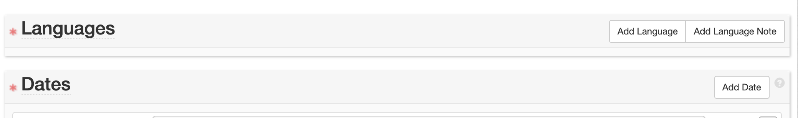
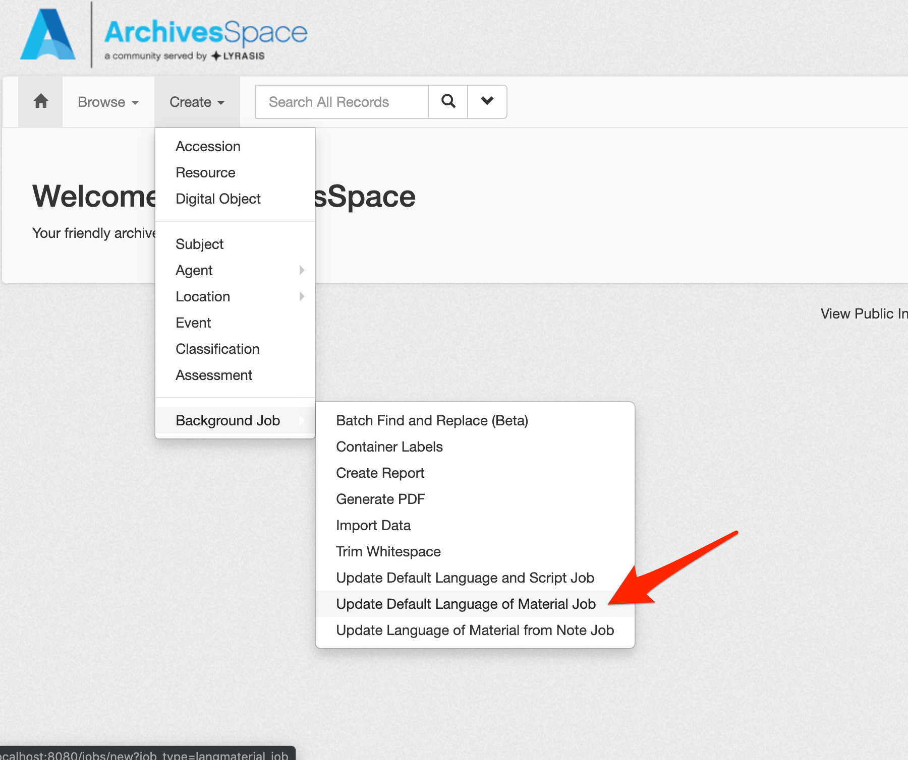
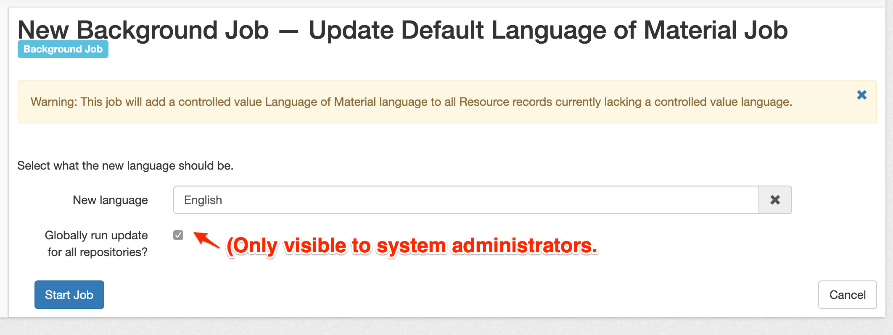
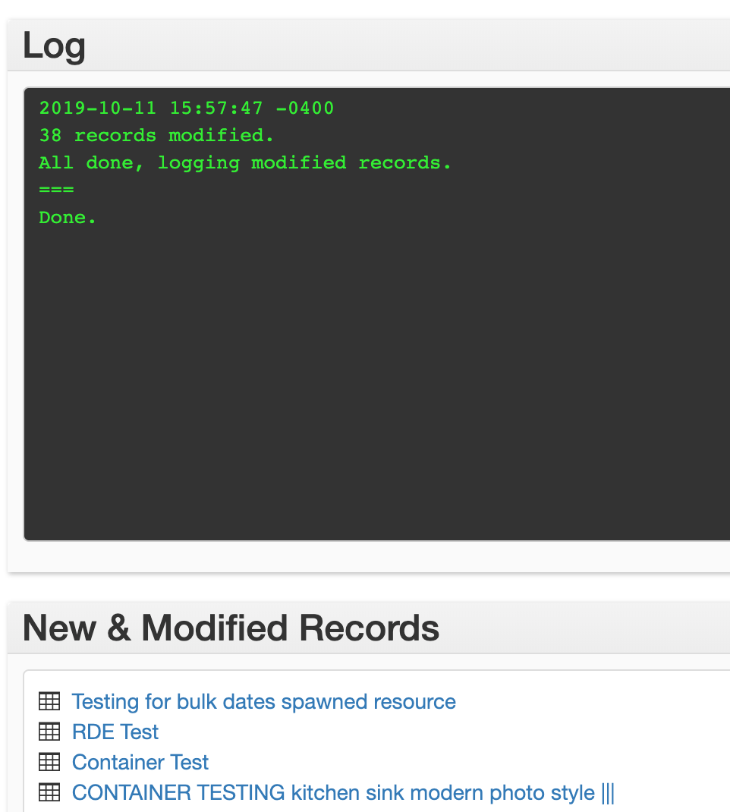
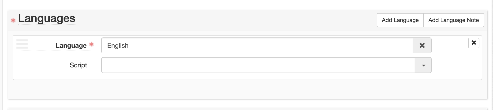

# batch_update_langmaterials

A plugin to batch update language of materials records for resource records currently lacking a controlled value language.

## Background

As of ArchivesSpace v2.7.0, users may record multiple languages and scripts of archival materials in Resource, Archival Object, Digital Object, and Digital Object Component records via dropdowns in a controlled value list, as well as a free-text note field.  These fields are located in the new Languages section of the relevant record types.

While a controlled value **Language of Material** is optional for Archival Object, Digital Object, and Digital Object Component records, it is now a **required** field for Resource records. The v2.7.0 upgrade includes database migrations to map existing language of material content to the new Language sub-record, however, while some ways of recording language information could be easily accommodated in this migration, some situations will require data cleanup. This is one of two plugins (also see: https://github.com/archivesspace-plugins/batch_update_langmaterials_from_note).

This plugin allows any user with manage_repository permissions or higher to initiate a background job that will identify Resource records lacking a required controlled value language and update only those records with a new language selected by the user.

## Using the plugin

After installing the plugin (see below):

1.  While logged in as a repository manager or higher, create a new "Update Default Language of Material" background job.

2.  Select the new controlled value language for all Resource records currently lacking a controlled value Language of Material sub-record.

3.  *(Optional)* If logged in as a System Administrator, select the "Globally run update for all repositories?" checkbox if you wish to populate all Resource records currently lacking a controlled value Language of Material sub-record in every repository with the language selected in step 2.
4.  Submit the job and wait for the job to complete.

5.  After the job completes you may review a list of records updated as part of the background job.  (Note: If you opted to "Globally run" the background job some links in the update records section may lead to "Resource Not Found" pages as those links point to a repository other than the one you are currently logged in to.)

## To install:

1. Stop the application
2. Clone the plugin into the `archivesspace/plugins` directory
3. Add `batch_update_langmaterials` to `config.rb`, ensuring to uncomment/remove the # from the front of the relevant AppConfig line.  For example:
`AppConfig[:plugins] = ['local', 'batch_update_langmaterials']`
4. Restart the application
